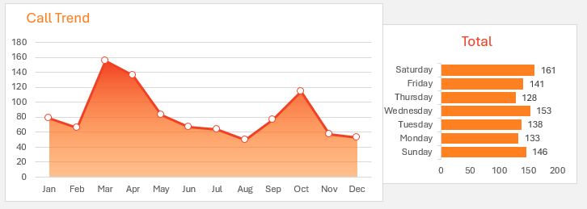
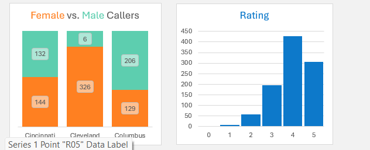

# Customer Support Dashboard using Excel

## Project Overview
This project is an Excel-based Customer Support Dashboard used for analyzing customer service performance through interactive visualizations and reports.

## Features
- Interactive Dashboard
- Pivot Table Analysis
- KPI Tracking
- Charts and Visualizations
- Customer Support Insights

## Tools Used
- Microsoft Excel
- Pivot Tables
- Charts
- Conditional Formatting

## Files Included
- CustomerSupportDashboard.xlsx
- Dashboard screenshots

## Dashboard Preview

### Main Dashboard

### Analysis View

## Insights
- Customer issue trends
- Performance analysis
- Resolution tracking
- Support efficiency monitoring

## Author
Kushmitha

